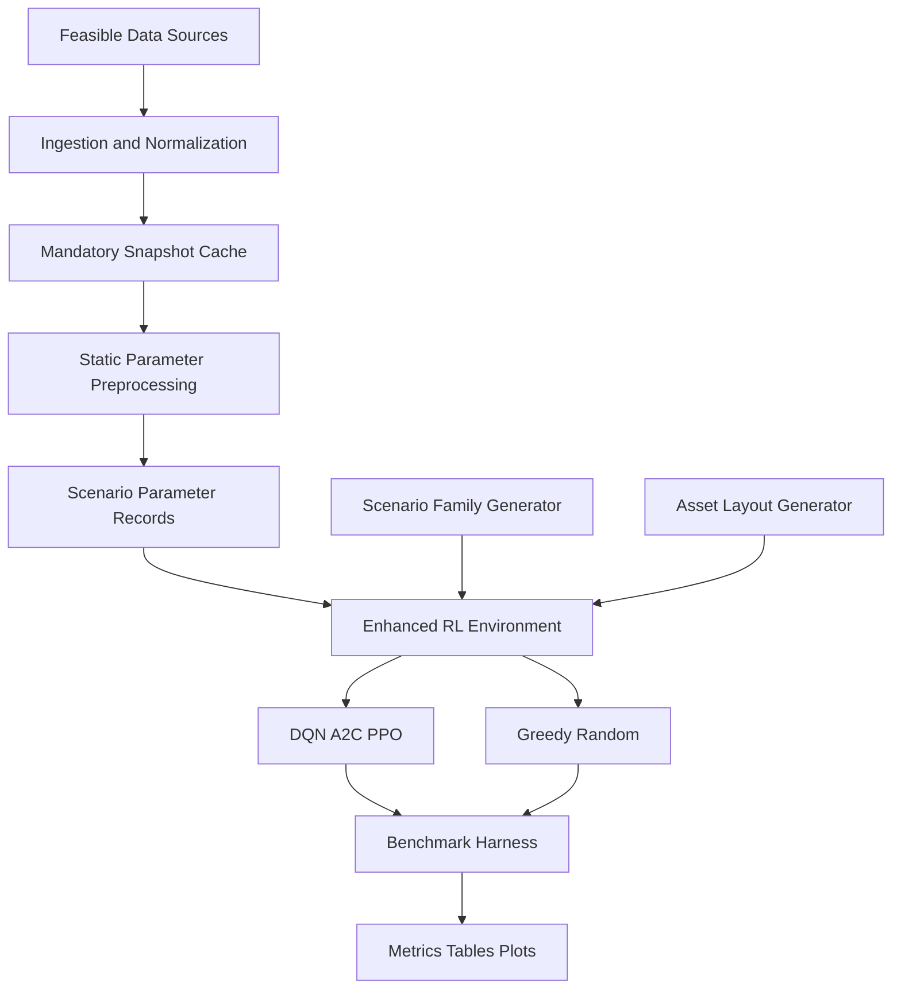
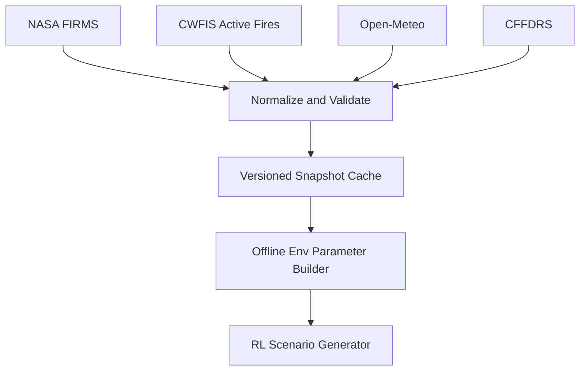
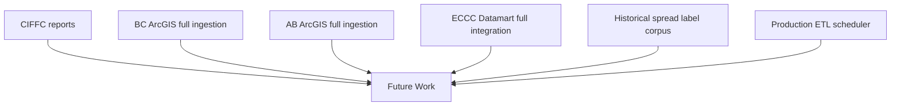

# Implementation Plan: Wildfire RL Benchmark (Canonical)

This file is the single source of truth for implementation and evaluation.

For the concrete training runner, tuning, checkpointing, and verification workflow, see `docs/planning/train-plan.md`.

Project direction:

**Empirical comparison of standard RL algorithms on an enhanced custom wildfire simulator with one objective: protect critical assets under limited suppression budget.**

---

## 1) Canonical Problem and Claim

### Problem

Given a spreading wildfire on a grid and limited suppression resources, what tactical policy best protects critical assets?

### Single objective

**Maximize critical asset survival under fixed per-episode suppression budget.**

### Claim boundaries

- Do not claim operational readiness.
- Do not claim superiority over real emergency protocols.
- Treat real data ingestion as scenario-construction support only.
- Do not claim empirical wildfire spread prediction.

### Canonical claim text

"We design an enhanced wildfire tactical suppression benchmark with protected assets, finite suppression budget, and heterogeneous spread, then compare RL and heuristic baselines under fixed scenario families and held-out tests."

---

## 2) Frozen Experimental Protocol (No Ranges)

- Grid size: **25 x 25**
- Episode horizon: **150 steps**
- Training budget per algorithm per seed: **200,000 env steps**
- Evaluation cadence during training: **every 20,000 steps**
- Evaluation episodes per checkpoint: **20**
- Final evaluation episodes per seed: **100**
- Number of seeds: **5** (`11, 22, 33, 44, 55`)

Any deviation must be explicitly labeled as an ablation and reported separately.

---

## 3) System Overview



---

## 4) Environment Specification (Canonical)

## 4.1 State representation

Observation at step `t` contains:

1. `fire_grid` (`25x25`) with cell types:
   - `0` unburned
   - `1` burning
   - `2` burned
   - `3` suppressed
   - `4` critical asset (unburned)
   - `5` critical asset (burning/burned marker in internal bookkeeping)
2. agent position `(row, col)`
3. remaining helicopter budget `heli_left`
4. remaining crew budget `crew_left`
5. helicopter cooldown `heli_cd`
6. crew cooldown `crew_cd`
7. severity bucket (`low`, `medium`, `high`) encoded one-hot
8. wind bias vector `(wx, wy)` if wind-bias mode enabled

Frozen observation rule:

- The canonical benchmark uses the encoded `fire_grid` plus scalar features listed above.
- Multi-channel observation variants are allowed only as ablations or future work and must be reported separately.

## 4.2 Action set and exact semantics

Action categories:

- mobility: `MOVE_N`, `MOVE_S`, `MOVE_E`, `MOVE_W`
- intervention: `DEPLOY_HELICOPTER`, `DEPLOY_CREW`

Actions:

- `0`: `MOVE_N`
- `1`: `MOVE_S`
- `2`: `MOVE_E`
- `3`: `MOVE_W`
- `4`: `DEPLOY_HELICOPTER`
- `5`: `DEPLOY_CREW`

Frozen action rule:

- The canonical action space contains exactly these 6 actions.
- `WAIT` is out of scope for the frozen benchmark and may appear only in ablations.

Hard definitions:

- Movement actions move the agent by one cell if in bounds; otherwise no movement.
- `DEPLOY_HELICOPTER` acts at the **agent's current cell** and affects a **3x3 neighborhood** (radius 1 Chebyshev).
- `DEPLOY_CREW` acts at the **agent's current cell only**.
- Both deployment actions can be invoked on burning and non-burning cells.
- Suppression effect:
  - burning cells in affected area become `suppressed` immediately,
  - unburned cells in affected area become `suppressed` firebreak cells.
- Budget/cooldown constraints:
  - helicopter: requires `heli_left > 0` and `heli_cd == 0`; then `heli_left -= 1`, set `heli_cd = 5`
  - crew: requires `crew_left > 0` and `crew_cd == 0`; then `crew_left -= 1`, set `crew_cd = 2`
- A deployment action is marked **wasted** if it changes zero cells (no state transition in targeted footprint) or if attempted while blocked by cooldown/budget.

Per-episode budgets:

- `heli_left` initial value: **8**
- `crew_left` initial value: **20**

## 4.3 Fire dynamics

- Fire spreads stochastically from burning cells to neighbors.
- Baseline spread probability is scenario-dependent from precomputed episode parameters.
- Heterogeneity mode for canonical runs: **wind bias enabled**.
- Wind bias increases ignition probability downwind and decreases upwind.
- Local flammability maps and control-tick versus fire-tick cadence are deferred to ablations or future work.

---

## 5) Reward Function (Single-Objective Aligned)

Reward at step `t`:

```text
r_t =
  - 75.0 * asset_cells_lost_t
  - 0.4  * new_burned_cells_t
  + 3.0  * burning_cells_suppressed_t
  - 1.5  * heli_used_t
  - 0.5  * crew_used_t
  - 1.0  * wasted_action_t
```

Terminal shaping:

- `+100` if fire extinguished and no asset loss.
- `+40` if episode ends with all assets intact (even if fire not fully extinguished).

### Reward sanity check (required)

Before full benchmark runs, run a short pilot (`20,000` steps, PPO, 1 seed) and verify:

- asset-loss events appear in training signal,
- suppression terms are not drowned out,
- return scale is stable (no exploding positive/negative episodes).

If unstable, adjust only `asset` and `burn` coefficients once, then freeze.

---

## 6) Scenario Families and Held-Out Split (Frozen)

## 6.1 Scenario factors

- Ignition layout: `center`, `edge`, `corner`, `multi_cluster`
- Severity: `low`, `medium`, `high`
- Asset layout type: `A` (one dense high-value cluster near moderate exposure), `B` (two smaller separated clusters with different exposure distances)

## 6.2 Training families (frozen)

- Train on ignition in `{center, edge, multi_cluster}` x severity in `{low, medium, high}` x asset layout `A`.
- Total train families: **9**.

## 6.3 Held-out test families (frozen)

- OOD ignition test: `corner` x `{low, medium, high}` x layout `A` (3 families).
- OOD asset test: `{center, edge, multi_cluster}` x `medium` x layout `B` (3 families).
- Total held-out families: **6**.

Report both in-distribution and held-out performance.

Split interpretation note:

- family holdout and temporal holdout are distinct and must be labeled separately in reporting.
- canonical train/validation runs should pass explicit scenario families rather than relying on environment defaults.
- the current temporal holdout artifact is a single-record diagnostic and should not be treated as a full held-out benchmark until expanded.

---

## 7) Algorithms to Benchmark

Required methods:

- **DQN** (value-based discrete baseline)
- **A2C** (lightweight on-policy baseline)
- **PPO** (strong policy-gradient baseline)
- **Greedy heuristic** (non-RL baseline)
- **Random** (sanity floor)

Recurrent baselines are not included because we will not add and test hidden regime shifts. 

---

## 8) Benchmark Harness and Logging (Required Infrastructure)

Exact metric definitions and the verification ladder are frozen in `docs/planning/train-plan.md`.

Requirements:

1. Unified runner for all algorithms.
2. Fixed config serialization to file per run.
3. Metrics written to CSV/JSON per checkpoint and final summary.
4. Distinct evaluation mode with fallback heuristics disabled for RL methods.
5. Seed-aware aggregation scripts for mean/std and confidence intervals.
6. Canonical checkpoint evaluation must exclude temporal holdout.

Core metrics:

1. mean episodic return
2. asset survival rate
3. containment success rate
4. mean burned-area fraction
5. standard deviation across seeds

Secondary metrics:

- time to containment
- resource efficiency
- wasted deployment rate
- held-out performance drop
- normalized burn ratio

Normalized burn ratio definition:

- `final_burned_area_with_policy / final_burned_area_no_action_same_scenario`
- The denominator comes from a no-action baseline rollout using the same scenario record and RNG seed.
- This is an evaluation-only metric and does not modify the training reward.

Metric interpretation notes:

- `time to containment` is conditioned on successful containment episodes only.
- `resource efficiency` is `successful_deployments / total_deployments`.
- pooled episode variance is not the benchmark aggregate; summarize per seed first, then report `mean +- std` across seeds.

---

## 9) Static Scenario Parameter Interface

The benchmark uses a static scenario-parameter dataset built offline from ingested wildfire, weather, and fire-danger records. These parameters are not predicted at runtime.

## 9.1 Snapshot inputs used during preprocessing

Canonical feature groups:

1. **Weather**
   - `wind_speed_km_h`
   - `wind_direction_deg`
   - `temperature_c`
   - `relative_humidity_pct`
   - `precipitation_mm`

2. **Fire danger indices**
   - `fwi`, `isi`, `bui`

3. **Incident context**
   - `area_hectares`
   - `latitude`, `longitude`
   - `province`

4. **Optional retained metadata**
   - `frp_mw`
   - `cffdrs_station_distance_km`
   - `dmc`, `dc`, `ffmc`

Preprocessing rule:

- The pipeline computes environment variables offline before writing the static scenario dataset.
- Any variable used in canonical benchmarking must be present in the stored record; benchmark mode must fail fast on missing required fields.

## 9.2 Stored parameter record for the simulator

For each scenario record, store:

1. `base_spread_prob`
2. `severity_bucket` in `{low, medium, high}`
3. `wind_direction` in `{N, NE, E, SE, S, SW, W, NW}`
4. `wind_strength` in `[0, 1]`
5. `ignition_seed`
6. `layout_seed`
7. optional logging fields such as `spread_rate_1h_m` if produced during preprocessing

Episode sampling rule:

- At reset, sample one cached parameter record for the episode.
- Parameters remain fixed for the full episode in canonical runs.

## 9.3 Why this interface is chosen

- Keeps the RL benchmark focused on tactical decision-making rather than learned spread prediction.
- Uses ingested data to define realistic variation in episode conditions while preserving deterministic reproducibility.
- Avoids runtime API dependence and avoids overclaiming forecasting capability.

---

## 10) Data Pipeline Plan and Feasibility

## 10.1 Feasible now (already in codebase)

- NASA FIRMS
- CWFIS active fires
- Open-Meteo
- CFFDRS station data

## 10.2 Mandatory snapshot pipeline



Snapshot requirements:

- versioned file naming (date + schema version)
- schema validation at load
- no silent fallback defaults during benchmark runs (fail fast)

## 10.3 High-risk overclaimed sources (future work)



---

## 11) Build Order (Updated)

1. Freeze objective, protocol numbers, held-out split.
2. Implement assets, budgets, cooldown semantics.
3. Implement wind-bias heterogeneity.
4. Define asset layouts `A` and `B` explicitly in the generator and docs.
5. Implement mandatory benchmark harness/log schema/eval mode.
6. Implement scenario generator with frozen train/test families.
7. Implement snapshot cache loader and offline parameter-to-env mapping.
8. Add evaluation-only normalized burn ratio reporting.
9. Add checkpoint metrics, config serialization, and best-checkpoint selection.
10. Run reward sanity pass and freeze coefficients.
11. Run algorithm smoke tests and short pilot tuning runs.
12. Run full multi-seed benchmarks for DQN/A2C/PPO + greedy/random.
13. Aggregate plots/tables and write limitations.

---

## 12) Out of Scope

- multi-agent coordination
- full GIS terrain integration
- historical replay validation
- complex dispatch logistics
- continuous-action routing

These remain future extensions.
